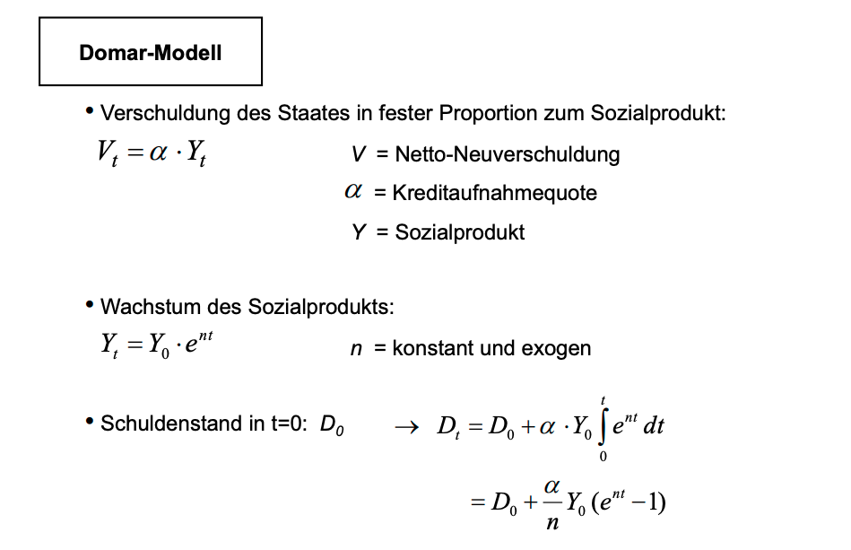
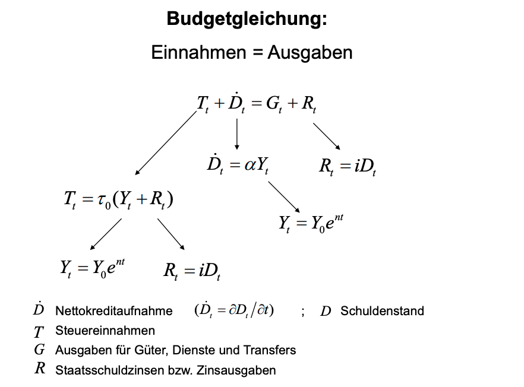

# Finanzwissenschaft III - Theorie und Politik der Staatsverschuldung

## 1. Entwicklung
Grundsätzlich ist zu sagen, dass Schulden ad infinitum aufnehmbar sind solange BIP-Wachstum > Realzins. Darüberhinaus ist allerdings der bestimmende Faktor der Konjunktur
nicht die Realwirtschaft, sondern vielmehr die Erwartungbildung der Unternehmen und Haushälte über die Wirtschaft, welche sich unabhängig von der Realwirtschaft entwickeln kann.

Die Staatschuldenquote ist als Wert nicht aussagekräftig, da sie nicht wirklich Assets und Liabilities vergleicht, sondern Liabilities mit einer einzigen Cash-Flow-Periode. Theoretisch müsste eine DCF-Analyse des BIP gemacht werden und diese dann mit den Schulden verglichen werden, doch dies ist schwierig, da es nicht trivial ist was für ein Zeitraum gewählt werden muss. 

### 1.1. Bundesrepublik Deutschland

Stetiges Wachstum an Schulden (ca. 2-3x alle 10 Jahre), keine Anwendung von kontrazyklischem (keynesianischen) Schuldenabbau in Boomphasen. Es stellt sich erst nach der Finanz- und Eurokrise eine Stagnation, bzw. ein Abbau der absoluten Schuldenlast ein.

### 1.2. Internationaler Vergleich

Die USA haben stets extrem hohe Staatsschulden gehabt, wenn sie in den Krieg zogen (Revol. War, Civil War, WWI, WWII). Die Japaner haben eine sehr hohe Staatschuldenquote, da sie durch Fiskalpolitik eine Hypothekenkrise aufgefangen haben, die Wirtschaft wächst jedoch deutlich schneller als die Inflation und ist somit lt. Weizsäcker nicht gefährdet.

## 2. Konsequenzen

### 2.1. Langfristige finanzwirtschaftliche Folgen der Staatsverschuldung

 1. Wie entwickelt sich langfristig die Schuldenstandsquote?
  
    Die Schuldenquote konvergiert nach dem Domar-Modell, da alpha/n auf einen festen Grenzwert konvergiert. Alpha ist die Kreditaufnahmequote eines Staates. n ist die konstante reale Wachstumsrate des Sozialprodukts.  
     
 
   Relation Zinsbelastung zu Sozialprodukt: (i x alpha)/n -> fester Grenzwert  
   
   Relation Zinsverpflichtungen zu besteuerbarem Einkommen: (i x alpha)/(i x alpha + n) -> fest und kleiner als 100%  
   
   Allerdings wird angenommen, dass n und i konstant und exogen sind, jedoch sind sie dies nicht . n beeinflusst i sowie auch anders herum.

 2. Kann durch eine permanente öffentliche Kreditaufnahme ein zusätzlicher Ausgabenspielraum gewonnen werden?

     

   Ausgabenspielraum definiert sich durch Finanzierungsvarianten. Es gibt drei Varianten: 
   - Einsparung von Ausgaben 

   Erweiter Ausgabenspielraum langfristig nur wenn das Sozialproduktswachstum (n) >> Verzinsung der Staatsschuld (i)
   - Erhebung zusätzlicher Steuern  

   Ausgabenspielraum kann langfristig erhalten werden.
   - Aufnahme zusätzlicher Kredite  

   Ausgabenspielraum kann theoretisch langfristig erhalten werden, jedoch ist es praktisch unwahrscheinlich, da die Anreize der Politik nicht so sind, dass sie Risiken langfristiger Verschuldung akkurat in das Meinungsbild der Bevölkerung einfließen lassen. Im Fall von n < i: Schuldenstandsquote konvergiert nicht mehr!
   
## 3. Gibt es Pro-Argumente?

Pro-Argumente existieren in der normativen Welt (Wie sollte die Welt sein?), nicht in der positiven Welt (Wie ist die Welt?).

Es gibt drei Hauptargumente:

 1. Kreditfinanzierte Stabilisierungspolitik

  - Nutzung des keynesianischen Multiplikators in Rezessionen, Finanzierung durch Schulden, da Steuereinnahmen niedriger sind
  - 2. Komponente wird stets vergessen: Schuldenabbau durch Ausgabenreduktion in Boomjahren
  - Stabilisierung bedingt die genaue Analyse des Konjunkturverlaufs, welcher noch nicht adäquat verstanden wird, da er abhängig von der Erwartungsbildung von Unternehmen und Haushalten ist

 2. Steuerglättung (Barro, 1979)

  - Steuerglättung ist die Theorie, dass Steuersätze konstant sein sollten, um die Erwartungsbildung der Unternehmen und Haushalte nicht komplizierter zu machen
  - Kosten, die nicht gedeckt werden können, werden durch Schulden finanziert und in Boomjahren getilgt

 3. Lastenverschiebung

  - Investionen werden durch Kredite finanziert
  - Die Lastenverschiebung wird oft wahltaktisch missbraucht, um dem Wähler weitere Konsumgüter zur Verfügung zu stellen

## 4. Last und makroökonomische Tragweiten

Thesen zu Lasten der Staatsverschuldung:

 1. Zinsen sind Belastung der neuen Generationen

  - Verteilungsproblem, da die Verschuldung auch in einer offenen Ökonomie aus dem privaten Kapitalstock schöpft. Zinsen kommen somit der neuen Generation auch oft zu Gute.
  - Dies wird jedoch problematischer sobald es eine sehr hohe Auslandsverschuldung gibt

 2. Tilgung ist problematisch

  - Refinanzierung ist für Staaten immer zur nächsten logischen Sekunde möglich
  - Staat hat im Gegensatz zum Privathaushalt das Mittel der Besteuerung

 3. Jedes Land hat einen begrenzten Verschuldungsspielraum, falls überschritten ist es in Bankrottgefahr
  
  - Nein, da Steuermacht
  - Inflationierungsmöglichkeit, falls eigene Währung

 4. Haushaltsdefizite verdrängen private Investitionen

  - `S = I` der Bruttosozialproduktfunktion: Wenn der Staat den Konsum erhöht verhindert er die private Kapitalakkumulation in einer geschlossenen Wirtschaft

 5. Haushaltsdefizite reduzieren die Nettoexporte

  - `EX - IM = S - I` in einer offenen Wirtschaft, `EX - IM = Nettokapitalexport`

### 4.1. Neoklassisches Paradigma

  - Investitionsquote ist negativ mit Schuldenstandsquote verbunden, weil Konsum gespartes Einkommen schluckt
  - Neoklassisches Modell auf Folie 52
  - Steuerfinanzierung auf lange Sicht besser als Schuldenfinanzierung, jedoch durch politische Kräfte nicht praktikabel

### 4.2. Keynesianisches Pagadigma

  - Anhang Angebotsökonomik:  
  These: Geringe Unternehmenskosten haben größeren Konjunktureffekt als liquide Verbraucher oder erhöhte Staatsausgaben

    * Geldpolitik: reine Inflationsvermeidung am Produktionspotenzial ausgerichtet
    * Finanzpolitik: Senkung der Staatsquote, Verringerung d. Neuverschuldung, Verr. d. Unternehmensbesteuerung,  
    Abschreibemöglichkeiten verbessern, Leistungs -und innovationsfreundliche Steuerregeln
    * Arbeitsmarktpolitik: Zurückhaltende Lohnpolitik, Förderung v. Arbeitnehmermobilität, Förderung der 
    Flexibilität v. Löhnen, Arbeitszeit und Beschäftigungsbedingungen
    * Förderung von Existenzgründungen
    * Deregulierung, Förderung von F&E
    * Saysches Theorem, Lafferkurve

## 5. Intergenerationelle Wohlfahrtseffekte

## 6. Generational Accounting

## 7. Neue Politische Ökonomie

## 8. Institutionelle Reformansätze

## 9. Europäische Wirtschafts- und Währungsunion

## 10. Europäische Schuldenkrise

	 
